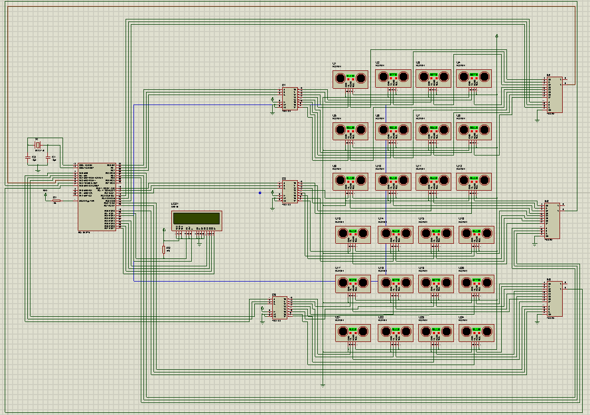

# Interfacing a 16F877A Controller with 24 SFR04 Ultrasonic Modules

This repository contains a PIC microcontroller project that connects a **16F877A** with **24 SFR04 ultrasonic modules**. Due to limited I/O pins on the controller, the design uses **74LS138** decoders for trigger signals and **74LS151** multiplexers for echo signals. A **16×2 character LCD** displays the top four measured distances from the ultrasonic sensors. 

---

## Table of Contents
1. [Project Overview](#project-overview)
2. [Hardware Components](#hardware-components)
3. [System Behavior](#system-behavior)
4. [Circuit Schematic (Proteus)](#circuit-schematic-proteus)
5. [LCD Messages and Display](#lcd-messages-and-display)
---

## Project Overview
This project demonstrates how to interface **24 SFR04 ultrasonic modules** with a single **16F877A** microcontroller. The modules each have:
- **Vcc** and **GND** (for power)
- **Trigger** and **Echo** pins (for distance measurement)

Since each sensor needs its own trigger and echo line, the project uses:
- **3 × 74LS138** (3-to-8 decoders) to manage the trigger signals
- **3 × 74LS151** (8-to-1 multiplexers) to handle echo signals

A **16×2 LCD** is used to show messages on startup and the top four distance readings once all modules have been triggered.

---

## Hardware Components
- **Microcontroller**: PIC 16F877A
- **Ultrasonic Modules**: 24 × SFR04
- **Decoders**: 3 × 74LS138
- **Multiplexers**: 3 × 74LS151
- **LCD**: 16×2 Character Display (4-bit mode)
- **Oscillator**: 4 MHz crystal with two 15 pF capacitors
- **Pull-up Resistors**: 10 kΩ on MCLR pin, 4.7 kΩ on the LCD RS pin
- Various other resistors, jumpers, and wiring as needed

---

## System Behavior

1. **Startup Message**  
   - On power-up, the first line of the LCD shows `"Welcome to"` and the second line shows `"SFR04 Modules"`.  
   - This message blinks 3 times, each blink separated by a **0.5-second** delay.

2. **Distance Measurement Loop**  
   - The PIC triggers each SFR04 module in sequence (one by one), waiting **1 second** before moving to the next.
   - After all 24 modules are triggered, it repeats from the first module indefinitely.

3. **Top 4 Readings Display**  
   - The LCD always shows the top 4 distances sorted in descending order.  
   - For example:
     ```
     US-05:99   US-13:95
     US-23:90   US-17:80
     ```
     - Where `US-05` the module ID with the highest reading, and `US-17` the fourth-highest reading.

4. **Timing Details**  
   - To read the distance from one SFR04:
     1. Make **Trigger** pin **LOW**.
     2. Wait 2 μs.
     3. Make **Trigger** pin **HIGH**.
     4. Wait 10 μs.
     5. Make **Trigger** pin **LOW**.
     6. Wait for **Echo** pulse to go HIGH and measure its duration.
   - This measured pulse length is used to calculate the distance.

---

## Circuit Schematic (Proteus)

Below is a sample placeholder image of the **Proteus** schematic layout.  



> **Figure 1:** Proteus Schematic

Key connections:
- **PortB** for Echo signals (interrupt pins optional).
- **PortD** (4-bit mode) + control pins to the LCD.
- **Decoders** (74LS138) for selecting which sensor to trigger.
- **Multiplexers** (74LS151) for reading one Echo at a time.

---

## LCD Messages and Display

1. **Blinking Welcome Message**  
   - Displays `"Welcome to"` on line 1 and `"SFR04 Modules"` on line 2.  
   - Blinks 3 times with a 0.5 s delay.

2. **Top 4 Distances**  
   - Updated continuously as each SFR04 module is read.  
   - Shows module IDs and their distances, sorted from highest to fourth-highest distance.

